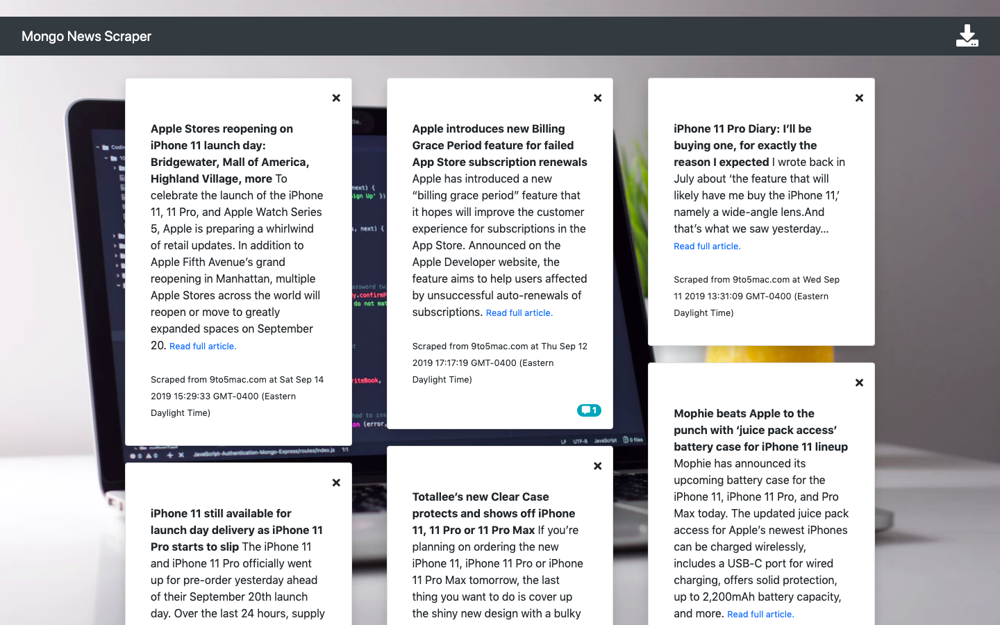
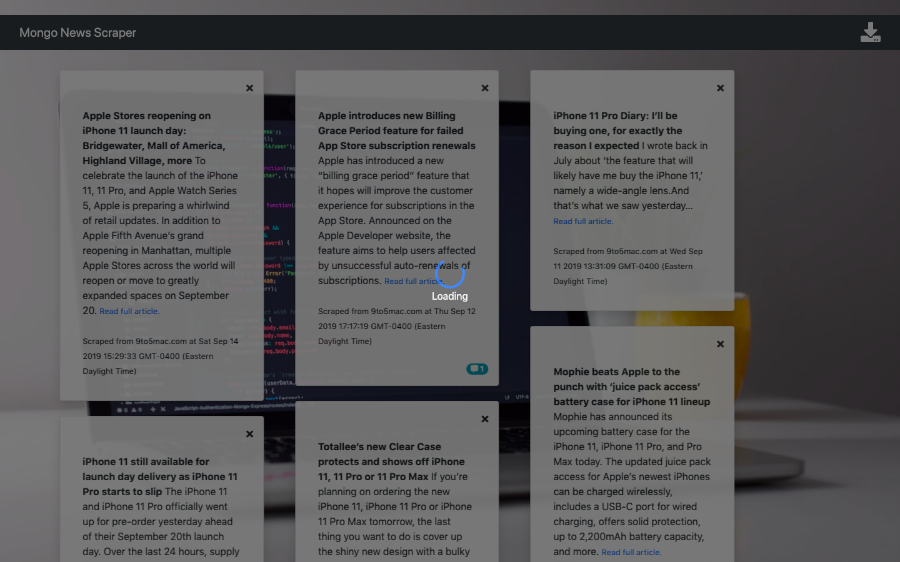

# **UNC Assignment #14 - Mongo Scraper**
> Created by Matthew Farmer

## About
'Mongo Scraper' is an application designed to scrape news articles from the Apple product news website, 9to5mac.com. This application is designed to demonstrate usage of Mongoose, MongoDB, Express, and the Cheerio NPM package.

## Walkthrough

### Viewing Articles

The image below illustrates the articles displayed to the user. Articles are listed in order from newest to oldest (with the newest items being in the leftmost column and the oldest items being in the rightmost column). Any articles with existing comments can be identified by a badge in the bottom-right corner of the card.

To access a specific article (and make comments, if desired), users may click on the card. Users may delete any article by clicking the 'x' at the top-right corner of the article card.

### Viewing and Adding Comments

The image below illustrates the view that a user will see when a specific article is clicked. The left side of the screen provides the article summary (and link to the full article) as well as a form for submitting new comments. The right side of the screen will list from newest to oldest all comments for the article if any exist. Notification will be provided when there are no comments to render.

### Automatic Scraping

The image below illustrates the loading screen with which users are presented when data is being retrieved (either from scraping or the database). When accessing the home route, a loading screen will appear to let users know that the latest articles are automatically being scraped.

## Additional Information

### Technologies Used

This application is built on NodeJS and is hosted on Heroku. It utilizes MongoDB for its database, Mongoose as its ORM, Handlebars for rendering templates, Express for routing, Axios for back-end HTTP requests, and the Cheerio NPM package for scraping data. AJAX calls are also frequently made to retrieve data from the back-end.
